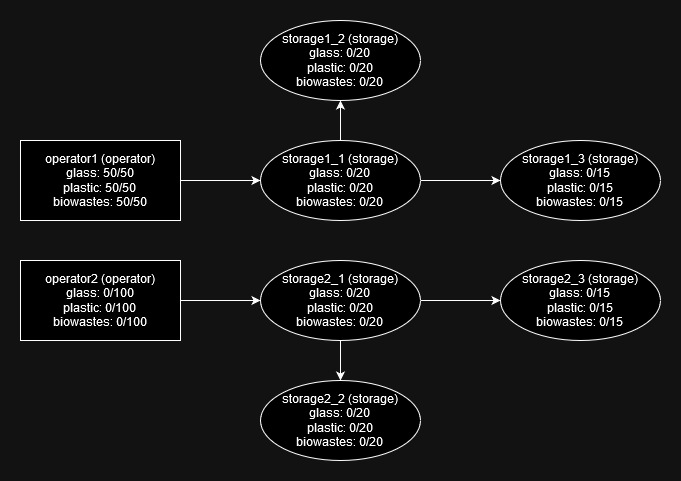

# RosAtom_task

## Описание

Задание: https://github.com/notafavor/test-cases/blob/main/case_1.md

Проект выполнен с использованием Django REST Framework

## Технические требования

Python, версия 3.10 или выше

Docker desktop

## Инструкция по запуску решения

1. Клонировать репозиторий на ваше устройство:
   ```
   git clone https://github.com/Egor-05/RosAtom_task
   ```
2. Перейти в директорию проекта:
   ```
   cd RosAtom_task
   ```
3. Собрать проект с помощью Docker Compose:
   ```
   docker-compose up --build
   ```
## URL-адреса проекта

### `http://127.0.0.1:8000/create_node/`

**Описание:** Обрабатывается представлением `CreateNodeView`. Позволяет создавать новые узлы

**Метод:** `POST`

**Формат передаваемого json:**

1. **name:** 

   * Тип: string

   * Описание: Название создаваемого узла.

2. **type:** 

   * Тип: string

   * Описание: Тип объекта, в данном случае "storage", указывающий, что это хранилище.

3. **connections:** 

   * Тип: array

   * Описание: Массив массивов, где каждый внутренний массив представляет собой информация о соединении:

     * Первый элемент: string — название узла с которым соединен создаваемый.

     * Второй элемент: integer — расстояние до указанного узла.
       
   * Примечание: Опциональное поле

4. **glass_capacity:**

   * Тип: integer

   * Описание: Вместимость хранилища для стеклянных отходов.

   * Примечание: Опциональное поле, но должна быть указана вместимость хотя бы одного из хранилищ

5. **plastic_capacity:**

   * Тип: integer

   * Описание: Вместимость хранилища для пластиковых отходов.
  
   * Примечание: Опциональное поле, но должна быть указана вместимость хотя бы одного из хранилищ

6. **biowastes_capacity:** 

   * Тип: integer

   * Описание: Вместимость хранилища для биологических отходов.
  
   * Примечание: Опциональное поле, но должна быть указана вместимость хотя бы одного из хранилищ


**Примеры передаваемых json:**

```json
{
    "name": "storage1",
    "type": "storage",
    "connections": [["node1", 30], ["node2", 50]],
    "glass_capacity": 30,
    "plastic_capacity": 30,
    "biowastes_capacity": 30
}
```

```json
{
    "name": "storage1",
    "type": "storage",
    "glass_capacity": 30,
    "plastic_capacity": 30,
    "biowastes_capacity": 30
}
```

```json
{
    "name": "storage1",
    "type": "storage",
    "glass_capacity": 30
}
```

<br/>

### `http://127.0.0.1:8000/move_wastes/`

**Описание:** Обрабатывается представлением `MoveWastesView`. Позволяет перемещать отходы между операторами и хранилищами.  

**Метод:** `POST`

**Формат передаваемого json:**

1. **name:**
   * Тип: string
   * Описание: Название оператора, из которого вывозятся отходы
   * Примечание: Опциональное поле

**Примеры передаваемых json:**

```json
{
  "name": "operator1"
}
```

```json
{}
```

<br/>

### `http://127.0.0.1:8000/get_occupancy/`

**Описание:** Обрабатывается представлением `GetOccupancyView`. Позволяет получать информацию о заполненности узла.

**Метод:** `GET`

**Формат передаваемых данных:**

1. **name:**
   * Тип: string
   * Описание: Название узла, информацию о котором нужно получить

**Примеры запросов:**

```
http://127.0.0.1:8000/get_occupancy/?name=operator1
```

<br/>

### `http://127.0.0.1:8000/get_distance/`

**Описание:** Обрабатывается представлением `GetDistanceView`. Позволяет получить расстояние между оператором и хранилищем.

**Метод:** `GET`

**Формат передаваемых данных:**
1. **from:**
   * Тип: string
   * Описание: Название оператора, расстояние от которого необходимо найти

2. **to:**
   * Тип: string
   * Описание: Название хранилища, расстояние до которого необходимо найти

**Пример запроса:**

```
http://127.0.0.1:8000/get_distance/?from=operator1&to=storage1
```

<br/>

### `http://127.0.0.1:8000/set_wastes/`

**Описание:** Обрабатывается представлением `SetWastesView`. Позволяет пополнить или опустошить хранилище отходов оператора

**Метод:** `POST`

**Формат передаваемого json:**

1. **operator:**
   * Тип: string
   * Описание: Название узла, хранилище отходов которого необходимо пополнить или опустошить

2. **glass:**

   * Тип: integer

   * Описание: Количество стеклянных отходов, положительное для пополнения, отрицательное для опустошения.

   * Примечание: Опциональное поле, но должно быть указанно количество хотя бы одного типа отходов.

3. **plastic:**

   * Тип: integer

   * Описание: Количество пластиковых отходов, положительное для пополнения, отрицательное для опустошения.
  
   * Примечание: Опциональное поле, но должно быть указанно количество хотя бы одного типа отходов.

4. **biowastes:** 

   * Тип: integer

   * Описание: Количество биологических отходов, положительное для пополнения, отрицательное для опустошения.
  
   * Примечание: Опциональное поле, но должно быть указанно количество хотя бы одного типа отходов.

**Примеры передаваемых json**

```json
{
    "name": "operator1",
    "glass": 20   
}
```

```json
{
    "name": "operator1",
    "glass": -20   
}
```

## Примечания:

* Тесты запускаются автоматически при запуске проекта

* При первом запуске проекта база данных заполнится данными в соответствии со следующей схемой:



* Данные возможно добавить с помощью панели администратора по URL `http://127.0.0.1:8000/admin/`, логин - `root`, пароль - `qwerty` 
